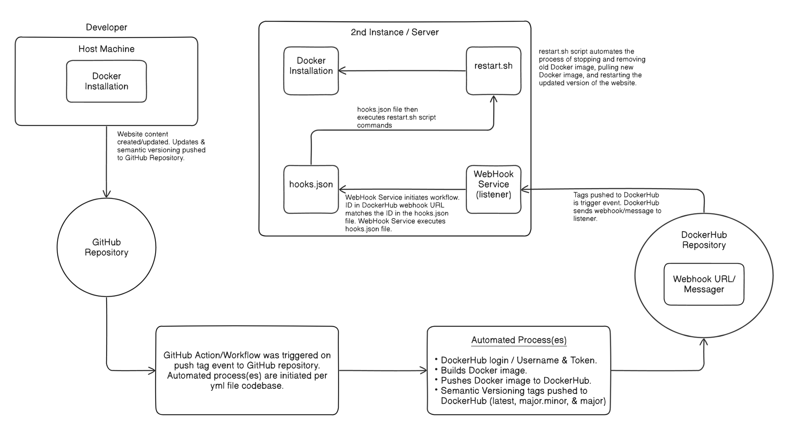

Aaron Schlotterbeck  
Spring 2024  
CEG 3120: Project 05  

## Semantic Versioning  

* CD Project Overview  

    In Project 4, we were learning about continuous integration by meeting the project objectives. These objectives included utilizing Docker to containerize an application. The process of containerizing an application includes packaging both the application and its dependencies into a container. This process allows our application to easily be deployed and to run consistently in various environments. Containers also provide a means to isolate applications from the system infrastructure. The next objective for this project includes using GitHub Actions and workflows to automate the project pipeline. Using GitHub Actions and workflows, we can customize and define various tasks and workflows within our GitHub repositories. The various tasks we want to execute and automate are defined using a YAML (yml) file. In our case, we are utilizing GitHub Actions and workflows to build a yml file that will automate the process of building and pushing our container image to our DockerHub account each time we push to the main branch of our GitHub repositories.

    For Project 5, we are expanding upon the continuous integration process by adding continuous deployment to automate the release of updates into the production environment. We modified our yml file to run when a tag had been pushed to our GitHub repository. Additionally, container images and tags were also pushed to DockerHub. We utilized Docker metadata-actions in the yml file to build and push images to DockerHub, as well as generate tags for our images in DockerHub. These tags demonstrated the use of semantic versioning by including images tagged with latest, major.minor, and major. Next, we had to set up our webhook to help automate our tasks and processes. We initially had to setup a script (my script file: restart.sh) that would stop and remove old container images, then pull a new container image from DockerHub, and lastly restart that container image. We also constructed a hooks.json file that could be triggered to execute the commands included in the restart.sh script. GitHub or DockerHub could be used to setup webhooks to help initiate a workflow, in this case, GitHub or DockerHub would be consider a messager. A second instance was used to install and configure a webhook service to act as a listener. Once an event is triggered (tags being pushed to DockerHub), DockerHub (or GitHub) sends a message (webhook), the webhook service (listener) receives the message and if the id in the hooks.json file matches the id in the DockerHub (or GitHub) webhook URL, the restart.sh script is executed. In the end, allowing us to automate the process of releasing an updated version of our website.  

    __Tools and Resources:__
    - GitHub Actions and workflows
    - GitHub repository
    - GitHub secrets
    - Git tags
    - Semantic Versioning
    - YAML file (yml)
    - DockerHub account
    - DockerHub repository
    - Docker tools and services
    - Dockerfile
    - Docker Metadata
    - WSL2 platform
    - Nginx Docker image
    - AWS EC2 instances
    - Adnanh's webhook  

* CI Diagram  

  

* How to generate a `tag` in `git` / GitHub?
    - You can generate either annotated tags in `git / GitHub` or you can generate lightweight tags.
    - Lightweight tags are created by using the command `git tag <tag-name>`.
        * An example would be `git tag v1.1.1`, which would generate a tag named `v1.1.1`.
    - Annotated tags are created by using the command `git tag -a <tag-name> -m "tag-message"`.
        * An example would be `git tag -a v1.1.2 -m "Creating updated version v1.1.2`.
    - After tags have been generated locally, they can then be pushed to your GitHub repository using the following commands:
        * The same command will push lightweight or annotated tags to your GitHub respository.
            - `git push origin <tag-name>`.
            - The lightweight tag would be `git push origin v1.1.1`.
            - The annotated tag would be `git push origin v1.1.2`.
    - You can also push multiple tags using `git push --tags`.
    - Tags can also be removed locally and remotely.
        * Locally, you can use `git tag -d <tag-name>`.
        * Remotely, you can use `git push origin --delete <tag-name>`.  

* Behavior of GitHub workflow
    - What does it do and when?
        * My GitHub workflow is triggered whenever there is a push to the main branch of my GitHub repository and any tags that match the pattern 'v*.*'. My GitHub Actions file builds a Docker image from the included codebase and pushes it to my DockerHub account under the specified tags (versions: latest, major, & major.minor) included in the GitHub Actions file.  

			- Trigger: this establishes that the workflow is triggered when there is a push to the main branch of my GitHub repository and any tags that match the pattern 'v*.*'.
			```
			on:
			  push:
			    branches:
			      - 'main'
                tags:
                  - 'v*.*'
            ```
            - Jobs: There is one job included in this workflow referenced by `docker`. This will run on the `ubuntu-latest` environment.
            ```
            jobs:
			  docker:
			    runs-on: ubuntu-latest
            ```
            - Steps:
				* Checkout: this action checks out the code from the repository.
                * Docker meta: generates metadata for the docker image based on the repository and current ref (branch and tag). The action utilizes the included semantic versioning patterns to generate tags.
                * Set up QEMU: uses the "docker/setup-qemu-action" to setup QEMU.
				* Set up Docker Buildx: uses the "docker/setup-buildx-action" to setup Docker Buildx.
				* Login to DockerHub: uses "docker/login-action" to login to Docker Hub using GitHub secrets credentials.
                * Login to GHCR: uses "docker/login-action" to login to GitHub Container Registry using GitHub secrets credentials.
				* Build and push: uses "docker/build-push-action" to build and push the container image to the specified DockerHub repository. Uses Docker metadata (generated from 'steps: Docker meta') to output tags/labels.
			```
                steps:
                  -
                    name: Checkout
                    uses: actions/checkout@v4
                  -
                    name: Docker meta
                    id: meta
                    uses: docker/metadata-action@v5
                    with:
                      images: |
                        aschlotterbeck/ceg3120
                      tags: |
                        type=ref,event=branch
                        type=semver,pattern={{major}}
                        type=semver,pattern={{major}}.{{minor}}
                  -
                    name: Set up QEMU
                    uses: docker/setup-qemu-action@v3
                  -
                    name: Set up Docker Buildx
                    uses: docker/setup-buildx-action@v3
                  -
                    name: Login to Docker Hub
                    uses: docker/login-action@v3
                    with:
                      username: ${{ secrets.DOCKERHUB_USERNAME }}
                      password: ${{ secrets.DOCKERHUB_TOKEN }}
                  -
                    name: Login to GHCR
                    uses: docker/login-action@v3
                    with:
                      registry: ghcr.io
                      username: ${{ github.repository_owner }}
                      password: ${{ secrets.GITHUB_TOKEN }}
                  -
                    name: Build and push
                    uses: docker/build-push-action@v5
                    with:
                      context: .
                      push: ${{ github.event_name != 'pull_request' }}
                      #push: true
                      tags: ${{ steps.meta.outputs.tags }}
                      labels: ${{ steps.meta.outputs.labels }}
            ```

* Link to Docker Hub repository (as additional proof)  
  - https://hub.docker.com/repository/docker/aschlotterbeck/ceg3120/general  

## Deployment  

* How to install Docker to your instance?  
  - How to install docker.
		* I am running Ubuntu 22.04.4 LTS on my device and had to use `sudo apt install docker.io` to install Docker on my second EC2 instance.
		* After installation, I used `which docker` to locate the executable files.
		* I also used `docker --version` to identify current version that was installed, which was Docker version 24.0.5.
		* Lastly, I used `systemctl status docker` to confirm Docker was successfully installed and up and running on my system.
		* To use Docker commands without using sudo, I used `sudo usermod -aG docker ubuntu` to add my user to the Docker group.  

* Container restart script
  - Justification & description of what it does:
    * My `restart.sh` script will give the docker commmand `docker stop baseballCaps` to stop the the running baseBall caps container image.
    * Then the docker command `docker remove baseballCaps` to remove the container image from the list of available container images so the `baseballCap` container image name can be reused.
    * The next docker command is `docker pull aschlotterbeck/ceg3120:latest`. This will pull a new container image, specifically the `aschlotterbeck/ceg3120:latest` container image from my DockerHub repository.
    * The last command `docker run -d -p 80:80 --name baseballCaps --restart always aschlotterbeck/ceg3120:latest` will run the new container image `aschlotterbeck/ceg3120:latest`, but by the newly assigned image name `baseballCaps`. This container will run in detached mode, which means it will run as a background process. Port 80 of the host machine will be mapped to port 80 of the container. The container will always restart automatically if it stops.
  - Where it should be on instance:
    * On the instance, the `restart.sh` script is located in my ubuntu home directory `/home/ubuntu`.
  - Add your script to your repository:
    * https://github.com/WSU-kduncan/s24cicd-aschlotterbeck/blob/main/deployment/restart.sh  

* Setting up a `webhook` on the instance:
  - How to install adnanh's `webhook` to the instance:
    * I used `sudo apt-get install webhook` to install adnanh's `webhook` to the instance.
    * Then used `which webhook` to locate the installation path: `/usr/bin/webhook`
    * Then used `systemctl status webhook.services` to find it was __inactive__ following installation. I will explain how to start the webhook service in the upcoming steps.  

* `webhook` task definition file
  - Description of what it does:
    * The task definition file will listen for an incoming webhook request from GitHub/DockerHub (DH in my project) and when the `id` matches the webhook request, the file will execute the `restart.sh` script located in the `/home/ubuntu` working directory.
  - Where it should be on instance:
    * On the instance, the `hooks.json` file is located in my ubuntu home directory `/home/ubuntu`.
  - Add your webhook definition file to your respository:
    * https://github.com/WSU-kduncan/s24cicd-aschlotterbeck/blob/main/deployment/hooks.json  

* How to start the `webhook`:
  - The command `webhook -hooks hooks.json -verbose` will start the webhook server using the hooks.json file as the configuration and will provide verbose output for detailed logging.  

* How to modify/create a webhook service file such that your webhook listener is listening as soon as the system is booted:
  - In the `/home/ubuntu root directory`, I used `cd /lib/systemd/system` and then `ls` to locate the `webhook.service` file.
  - I used `sudo vim webhook.service` to open the file in vim and to modify the file contents.
  - In the `ConditionPathExists=/etc/webhook.conf` line I replaced the `/etc/webhook.conf` portion with the path to my `hooks.json` file, which is `/home/ubuntu/hooks.json`.
  - In the `ExecStart=/usr/bin/webhook -nopanic -hooks /etc/webhook.conf` line I replaced the `/etc/webhook.conf` portion with the path to my `hooks.json` file, which is `/home/ubuntu/hooks.json` and added `-verbose` at the end of the line to improve logging info of the service.
  - Then I used `Esc` and `wq` to save and close the modified `webhook.service` vim file.
  - After the file modifications, I had to reload the webhook service using the command `sudo systemctl daemon-reload`.
  - After the service reload, I used `sudo systemctl restart webhook.service` to restart the service.
  - Then I used `systemctl status webhook.service` to confirm the webhook service was actively running on the instance.  

  - Add your webhook service file to your repository:
    * https://github.com/WSU-kduncan/s24cicd-aschlotterbeck/blob/main/deployment/webhook.service  

* How to configure GitHub OR DockerHub to message the listener:
  - In DockerHub, I clicked on the `Webhooks` tab.
  - In `Webhooks`, I entered a name for my webhook `my hook` and added my Webhook URL `http://44.222.56.54:9000/hooks/spidey`. Then clicked on `+` to add the newly configured webhook.
    * EIP of the instance: 44.222.56.54
    * Webhook port: 9000
    * Hook Id: spidey  

## Demonstration  

* Proof that the CI & CD workflow work:  

## Diagramming  

__Diagram is included with project description in Part 1__  

References:  
* ChatGPT
* Class lectures
* Links provided in Pilot
* Links provided on Discord
* Links provided within Project 5
